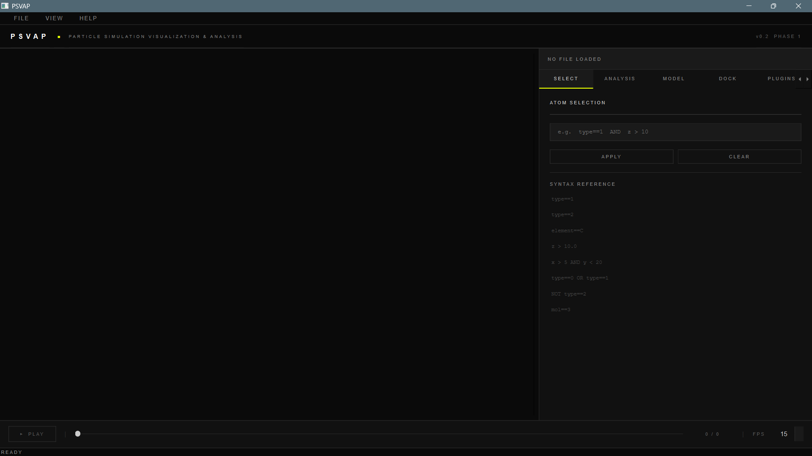
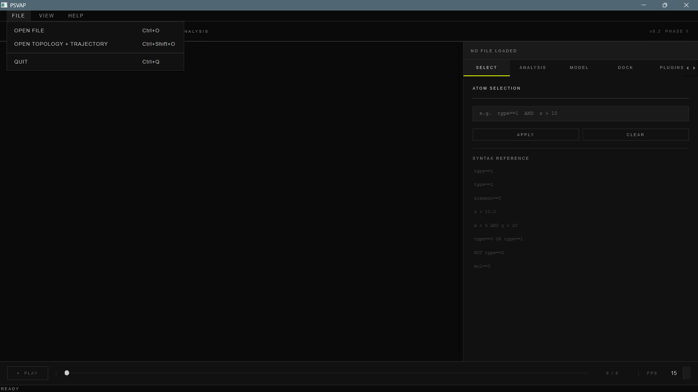
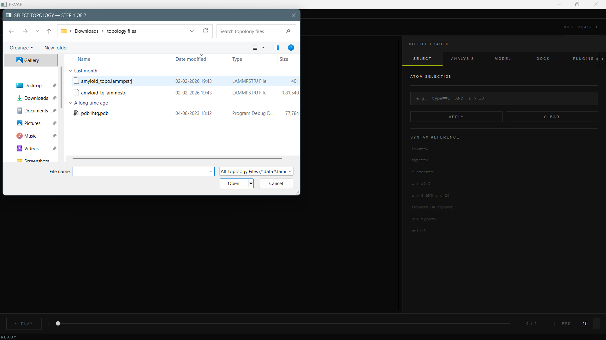
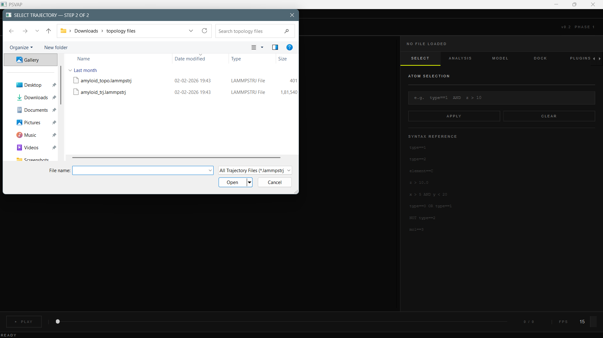
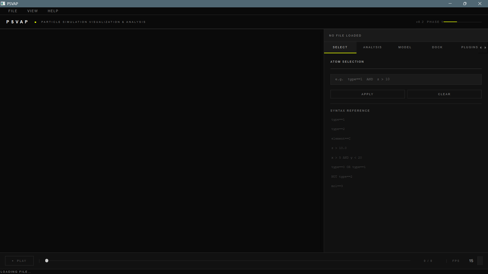

# PSVAP — Particle Simulation Visualization & Analysis Package

> A high-performance, cross-platform research tool for **3D visualization**, **structural modeling**, and **thermodynamic analysis** of molecular dynamics (MD) simulations.

PSVAP is a post-simulation analysis and visualization tool for particle-based molecular dynamics data. It is **not** a simulation engine. It reads trajectory and structure files from external engines (LAMMPS, GROMACS, AMBER, CHARMM, etc.) and provides a Python-first, plugin-ready environment for analysis and visualization.

---

## Table of Contents

- [Feature Gallery](#-feature-gallery)
  - [Getting Started & Interface](#️-getting-started--interface)
  - [Core Visualization & Rendering](#-core-visualization--rendering)
  - [Advanced Analysis Suite](#-advanced-analysis-suite)
  - [Molecular Modeling & Setup](#️-molecular-modeling--setup)
  - [Molecular Docking Workflow](#-molecular-docking-workflow)
  - [Configuration & Export](#️-configuration--export)
- [Folder Structure](#-folder-structure)
- [Installation & Setup](#-installation--setup)
- [Common Errors & Fixes](#-common-errors--fixes)

---

## 🖼 Feature Gallery

---

### 🖥️ Getting Started & Interface

> The core interface is designed for high-density data handling with a minimal learning curve.

<details>
<summary><b>▶ Click to expand — Interface Screenshots</b></summary>

<br>

| Feature | Preview | Description |
|---|---|---|
| **Main Dashboard** |  | The initial state of the PSVAP interface, featuring a dark-themed 3D viewport, syntax-driven selection panel, and playback timeline. |
| **File Import** |  | Dual import modes: single file loading or split Topology + Trajectory loading for complex datasets. |
| **Topology Selection** |  | Step 1 of the loading process — selecting the structural foundation (`.pdb`, `.data`, `.lammpstrj`). |
| **Trajectory Mapping** |  | Step 2 — linking the structural model to its corresponding movement data frames. |
| **Processing State** |  | Real-time feedback during data parsing with a progress indicator and status console. |

</details>

---

### 🔬 Core Visualization & Rendering

> PSVAP supports industry-standard formats like LAMMPS and PDB with granular control over how atoms and bonds are displayed.

<details>
<summary><b>▶ Click to expand — Rendering Screenshots</b></summary>

<br>

| Feature | Preview | Description |
|---|---|---|
| **LAMMPS Integration** |  | A successful render of a LAMMPS simulation showing 8,000 atoms and 15,000 bonds with real-time frame/step metadata. |
| **PDB Support** |  | High-fidelity rendering of a Protein Data Bank structure (98,000 atoms) with element-specific color coding. |
| **Hybrid Mode** |  | The default render mode providing a detailed look at molecular interconnectivity and chemical topology. |
| **Clean View** |  | A simplified render mode that removes bond lines to focus on spatial distribution and density gradients. |
| **Syntax Filtering** |  | Highlights the power of the selection engine (e.g., `element == N`) to isolate specific atom types for quantitative analysis. |

</details>

---

### 📊 Advanced Analysis Suite

> The Analysis tab provides a deep dive into the physics and geometry of your simulation.

<details>
<summary><b>▶ Click to expand — Analysis Screenshots</b></summary>

<br>

| Feature | Preview | Description |
|---|---|---|
| **Clustering** |  | Group similar frames from a trajectory into distinct structural clusters based on cutoff distances. |
| **Geometry** |  | Interactively measure Bond Lengths, Bond Angles, and Dihedral Angles in real-time. |
| **Stability (RMSD)** |  | Calculate Root Mean Square Deviation to track structural variance over simulation time. |
| **Alignment** |  | Superimpose target and template structures to identify conformational changes. |
| **Sequence Mapping** |  | A 1D-to-3D bridge — click a residue name to instantly locate it in 3D space. |
| **Surface Analysis** |  | Generate Solvent Accessible Surface Area (SASA) maps to identify binding pockets and envelopes. |
| **Ligand Focus** |  | Automatically detect and center on small molecules bound within a protein environment. |
| **QSAR Modeling** |  | Calculate molecular descriptors like LogP to link chemical structure to biological activity. |
| **Pharmacophore** |  | Identify interaction features like H-bond donors/acceptors as 3D geometric vectors. |
| **Water Mapping** |  | Track solvent behavior and identify high-occupancy hydration shells around the solute. |
| **Pocket Prediction** |  | Predict potential binding "hotspots" based on surface geometry and chemical properties. |

</details>

---

### 🏗️ Molecular Modeling & Setup

> Prepare your system for production-grade Molecular Dynamics runs.

<details>
<summary><b>▶ Click to expand — Modeling Screenshots</b></summary>

<br>

| Feature | Preview | Description |
|---|---|---|
| **System Prep** |  | Clean raw files by adding missing atoms, correcting bond orders, and assigning force fields. |
| **Coarse-Graining** |  | Simplify large systems by mapping atom clusters into single "beads" for long-timescale runs. |
| **Mutation Tool** |  | Interactively swap amino acids and optimize side-chain orientations. |
| **Alanine Scanning** |  | Systematic mutagenesis to identify residues critical for protein stability or affinity. |
| **Solvation** |  | Place molecules in a water box and add counter-ions (Na⁺/Cl⁻) to reach target concentrations. |
| **MD Setup** |  | Define temperature, pressure, time steps, and production duration for the simulation engine. |

</details>

---

### ⚓ Molecular Docking Workflow

> Predict ligand-receptor interactions with precision.

<details>
<summary><b>▶ Click to expand — Docking Screenshots</b></summary>

<br>

| Feature | Preview | Description |
|---|---|---|
| **Dock Prep** |  | Assign Gasteiger charges and define flexible ligand torsions for docking. |
| **Grid Box** |  | Interactively define the 3D search space centered on the binding pocket. |
| **Docking Engine** |  | Execute the docking search with adjustable exhaustiveness and algorithm selection. |
| **Results Viewer** |  | Rank and inspect predicted binding poses by energy affinity (kcal/mol). |

</details>

---

### ⚙️ Configuration & Export

> Professional output tools for publications and presentations.

<details>
<summary><b>▶ Click to expand — Export & Settings Screenshots</b></summary>

<br>

| Feature | Preview | Description |
|---|---|---|
| **Plugin Manager** |  | Extend PSVAP with custom scripts and community-built analysis tools. |
| **Settings** |  | Customize UI scaling, GPU performance settings, and default file paths. |
| **Publication Image** |  | Export 4K, transparent-background figures for journals and posters. |
| **Video Rendering** |  | Record simulation trajectories into high-bitrate video files with custom FPS. |
| **Data Export** |  | Save filtered coordinates and analysis logs into CSV, JSON, or chemical formats. |
| **Software Info** |  | Versioning, licensing, and citation info for scientific documentation. |

</details>

---

## 📁 Folder Structure

At the top level:

| Path | Description |
|---|---|
| `main.py` | Entry point; starts the Qt application only. |
| `README.md` | This summary. |
| `CHANGELOG.md` | Living changelog; update every significant change. |
| `INSTALL.md` | Setup instructions for new developers. |
| `requirements.txt` | Pinned runtime dependencies. |
| `requirements-dev.txt` | Testing and linting dependencies. |
| `pyproject.toml` | Package metadata and build configuration. |
| `app/` | Application controller layer. |
| `core/` | Core data layer, including `SystemModel`. |
| `io/` | Parsers, exporters, and external engine integration. |
| `visualization/` | Visualization engine wrapping PyVista. |
| `analysis/` | Scientific analysis modules. |
| `modeling/` | Structure modification and MD setup tools. |
| `plugins/` | Python plugin sandbox and public API. |
| `gui/` | PySide6 GUI layer. |
| `tests/` | Automated tests and fixtures. |
| `docs/` | Documentation and diagrams. |

---

## 🚀 Installation & Setup

### Prerequisites

- Python 3.11 (recommended)
- Git
- Conda (Miniconda / Anaconda) — strongly recommended
- C/C++ build toolchain:
  - **Windows:** Visual Studio Build Tools (MSVC + CMake)
  - **Linux:** `build-essential` (gcc, g++, make)

---

### Clone the Repository

```bash
git clone https://github.com/KatariyaMohit/PSVAP.git
cd PSVAP
```

---

### Environment Setup (IMPORTANT)

> Always use **Anaconda Prompt** or a fresh terminal.

#### Create Conda Environment

```bash
conda create -n psvap python=3.11
```

Press `y` when prompted.

#### Activate Environment

```bash
conda activate psvap
```

You should see:

```
(psvap) C:\Users\username\Software Project\PSVAP>
```

---

### Install Dependencies (Correct Order)

> **IMPORTANT:** Install heavy libraries via `conda`, not `pip`

#### Install Core Scientific & GUI Libraries

```bash
conda install -c conda-forge rdkit pyvista vtk pyvistaqt pyside6=6.6 qt=6.6
```

This ensures:
- No DLL errors
- Compatible Qt + VTK + PyVista stack

#### Install Remaining Python Dependencies

```bash
pip install -r requirements.txt
```

#### Install Developer Tools (Optional)

```bash
pip install -r requirements-dev.txt
```

---

### Run the Application

```bash
conda activate psvap
cd ..
python PSVAP\main.py
```

> **Always run from the root folder:** `C:\Users\username\Software Project`

---

## ⚠️ Important Notes

Always follow this rule:

| Library Type | Install Using |
|---|---|
| RDKit | `conda` |
| PySide6 (Qt GUI) | `conda` |
| VTK / PyVista | `conda` |
| Other Python libs | `pip` |

### ❌ Avoid This (causes errors)

Mixing `pip` and `conda` for:
- PySide6
- VTK
- PyVista

---

## 🛠 Common Errors & Fixes

### `conda not recognized`
- Add Miniconda to PATH
- Restart terminal

---

### `No module named PySide6`

```bash
conda install -c conda-forge pyside6
```

---

### `DLL load failed while importing QtWidgets`

```bash
pip uninstall PySide6 PySide6-Essentials PySide6-Addons -y
conda remove pyside6 qt --force -y
conda install -c conda-forge pyside6=6.6 qt=6.6
```

---

### VTK / PyVista Import Errors

```bash
conda install -c conda-forge vtk pyvista pyvistaqt
```

---

## 🔄 Clean Reset (If Things Break)

```bash
conda remove -n psvap --all
conda create -n psvap python=3.11
conda activate psvap
conda install -c conda-forge rdkit pyvista vtk pyvistaqt pyside6=6.6 qt=6.6
pip install -r requirements.txt
```

---

## ✅ Summary

| Rule | Detail |
|---|---|
| ✅ Use `conda` for heavy dependencies | RDKit, PySide6, VTK, PyVista |
| ✅ Use `pip` only for lightweight packages | Everything in `requirements.txt` |
| ✅ Keep environment clean | Avoid DLL conflicts |